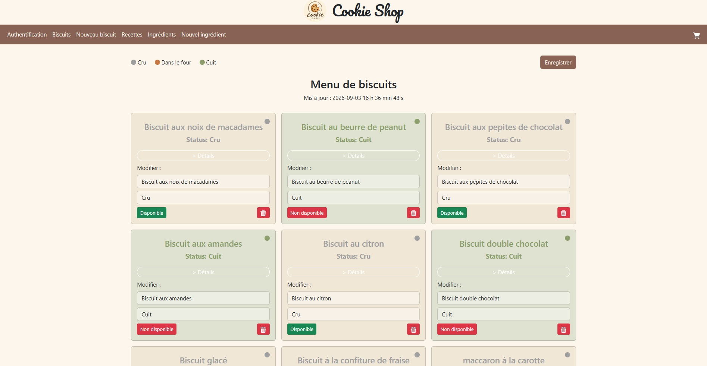
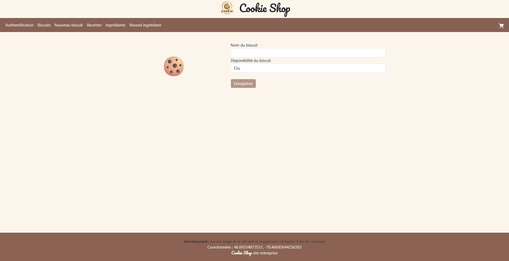
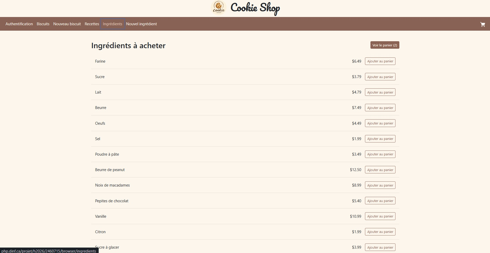
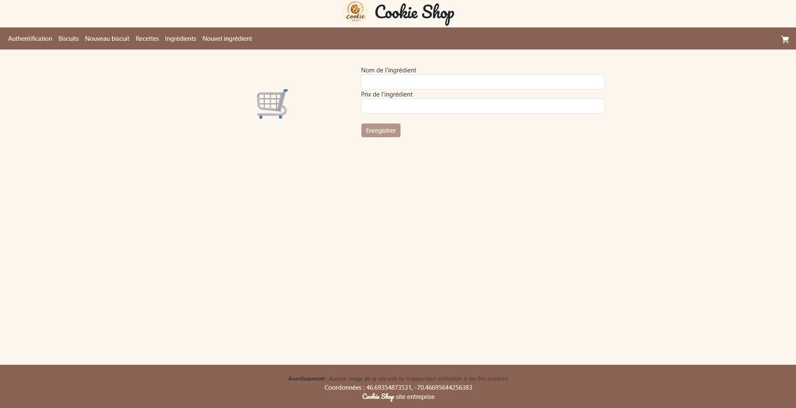
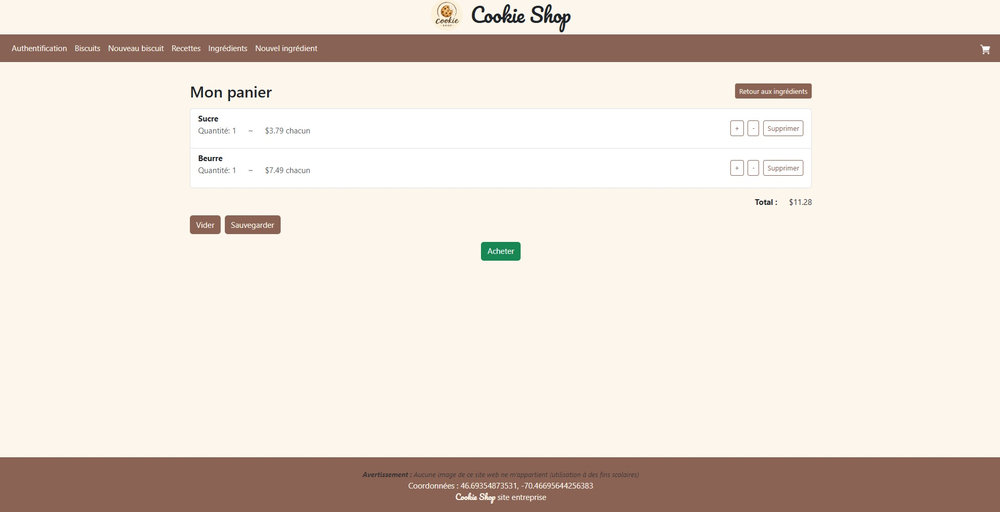
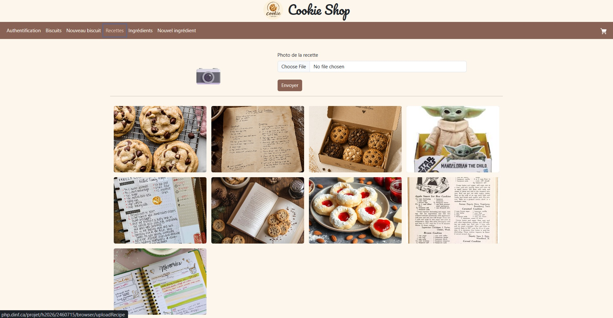
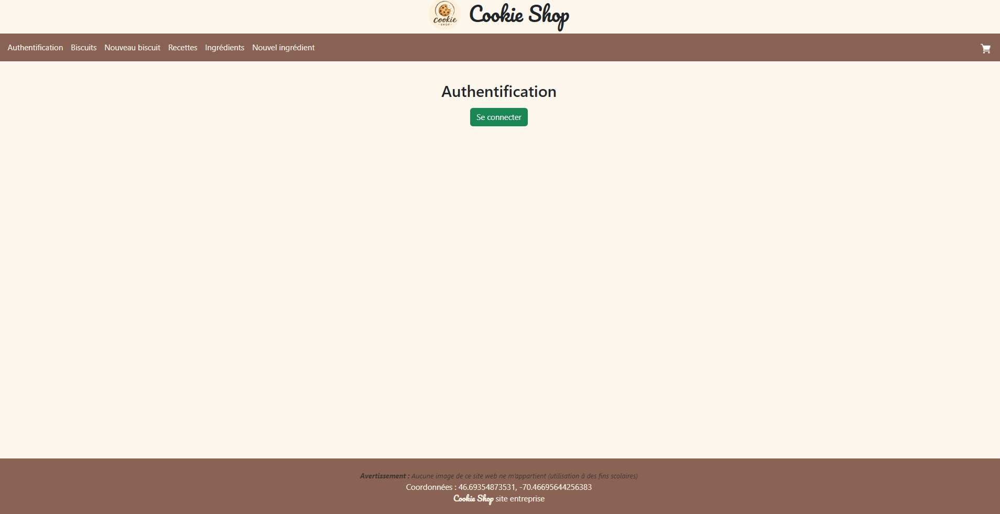

# Biscuits

Biscuits is an Angular web application for managing cookies, ingredients, recipes, and shopping carts. It is made to simulate a company-side website for a cookie bakery.

The application includes a PHP/MySQL backend for storing cookies, ingredient, and cart data.

## Demo

[Watch the demo video](demo/demo_video.mp4).

The following screenshots show the main application screens:

| Biscuits |
| --- |
|  |

| Add a biscuit | Ingredients |
| --- | --- |
|  |  |

| Add an ingredient | Shopping cart |
| --- | --- |
|  |  |

| Recipes | Authentication |
| --- | --- |
|  |  |


## Features

- Simulated user authentication
- View biscuit details and baking status
- Add, update, delete, and save cookies
- Start baking biscuits individually or all at once
- Manage ingredients and prices
- Add ingredients to a shopping cart
- Persist the cart locally and on the server
- Upload and display recipe images
- Calculate taxes and shipping costs
- Pay with PayPal in Canadian dollars

## Technologies

- Angular 21
- TypeScript
- SCSS
- Bootstrap 5
- PHP
- MySQL
- PayPal JavaScript SDK

## Project structure

```text
src/                 Angular application
backend/             PHP API endpoints
public/images/       Application images
public/uploads/      Recipe and food images
```

## Requirements

- Node.js and npm
- Angular
- PHP
- A local PHP server such as Apache


Create a MySQL database named `cookies` with the following tables:

- `cookie`
  - `id`
  - `name`
  - `status`
  - `bakingtime`

- `ingredient`
  - `id`
  - `name`
  - `price`

- `cart`
  - `id`
  - `name`
  - `price`
  - `quantity`

Configure the database connection in:

```text
backend/connecter_angular.php
```

The PHP backend must be served by Apache or another PHP-compatible server. The Angular application expects the backend to be available at:

```text
/backend/
```

## Development server

Start the Angular development server:

```bash
npm start
```

Open the application at:

```text
http://localhost:4200
```

Make sure the PHP backend is running at the same host or that the API paths in the Angular services point to the correct backend URL.

The database username and password in `backend/connecter_angular.php` are placeholders. Replace them with local credentials when running the application.

## Production build

Create a production build:

```bash
npm run build
```

The compiled application is generated in the `dist/` directory.

## Available routes

| Route | Description |
| --- | --- |
| `/auth` | Authentication |
| `/biscuits` | View and manage biscuits |
| `/biscuits/:id` | View a single biscuit |
| `/edit` | Add a biscuit |
| `/ingredients` | View ingredients |
| `/editIngredient` | Add an ingredient |
| `/panier` | View the shopping cart |
| `/paiement-paypal` | Checkout |
| `/uploadRecipe` | Upload and view recipe images |

## Privacy and credentials

This repository does not include personal database credentials, private location information, or a personal PayPal client ID. Replace the `xxxxxx` placeholders with local or project-specific values when testing those features.
